<div align="center">


<a href="https://github.com/trickell">
  
</a>

<br/>

<a href="https://www.linkedin.com/in/jmadriga"></a>
<a href="https://dev.to/trickell"></a>
<a href="https://github.com/trickell?tab=followers"></a>


</div>



## ⚡ About Me

```text
> whoami
  Designer-turned-engineer. I build things that look as good as they work.

> current_focus
  🛒 Microcart        — a miniature Shopify, rebuilt in Next.js
  🤖 AI assistants    — local-first voice HUDs, RAG knowledge bases
  🎨 madrigal.design  — portfolio v2, rebuilt in React

> ask_me_about
  AI models · API design · data scraping & structuring

> fun_fact
  "The world is beyond our comprehension, but science tethers close to it."
```

## 🧰 Arsenal

<div align="center">


</div>

## 🛰️ Featured Builds

<div align="center">

| 🚀 Project | What it is | Stack |
|:---|:---|:---|
| **[Microcart](https://github.com/trickell/microcart)** | A miniature cart platform — like Shopify, but featherweight | `JavaScript` → `Next.js` |
| **[FestConnect](https://github.com/trickell/festconnect)** | Reconnect with vendors & lost friends at festivals | `Laravel / Blade` |
| **[PH0MBER](https://github.com/trickell/phomber_ex)** | Open-source information gathering & recon toolkit | `Python` |
| **[Sorcery Scraper](https://github.com/trickell/sorcery_data_scraper)** | Data scraping with a touch of magic | `JavaScript` |
| **[Madtography](https://github.com/trickell/madtography)** | My photography, framed in code | `HTML/CSS` |

</div>


## 📊 Signal Readout

<div align="center">


</div>

## 🐍 Contribution Snake

<div align="center">


</div>

## 🧊 3D Contribution Grid

<div align="center">


</div>


## 📡 DEV Transmissions

<div align="center">

<a href="https://dev.to/trickell"></a>

<br/><br/>

<!-- DEVTO-BADGES:START -->
<a href="https://dev.to/trickell" title="Summer Bug Smash Completion Badge"></a>
<a href="https://dev.to/trickell" title="Hermes Agent Challenge Completion"></a>
<a href="https://dev.to/trickell" title="Two Year Club"></a>
<a href="https://dev.to/trickell" title="OpenClaw Challenge Completion Badge"></a>
<a href="https://dev.to/trickell" title="Notion MCP Challenge Completion"></a>
<a href="https://dev.to/trickell" title="Cloud Run Badge"></a>
<a href="https://dev.to/trickell" title="DEV Weekend Challenge Completion"></a>
<a href="https://dev.to/trickell" title="GitHub Copilot CLI Challenge Runner-Up"></a>
<a href="https://dev.to/trickell" title="2 Week Community Wellness Streak"></a>
<a href="https://dev.to/trickell" title="Google AI Challenge Completion"></a>
<a href="https://dev.to/trickell" title="1 Week Community Wellness Streak"></a>
<a href="https://dev.to/trickell" title="Google AI"></a>
<a href="https://dev.to/trickell" title="Frontend Challenge Completion Badge"></a>
<a href="https://dev.to/trickell" title="Writing Debut"></a>
<a href="https://dev.to/trickell" title="One Year Club"></a>
<!-- DEVTO-BADGES:END -->

<br/>

<sub>badges auto-sync daily from <a href="https://dev.to/trickell">dev.to/trickell</a></sub>

</div>

## 🏆 Trophy Deck

<div align="center">


</div>

<!-- ═══════════════════════ FOOTER ═══════════════════════ -->
<div align="center">


<sub>⚡ <i>Systems nominal · awaiting directive</i> ⚡</sub>

</div>
